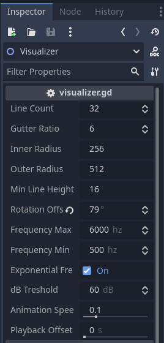
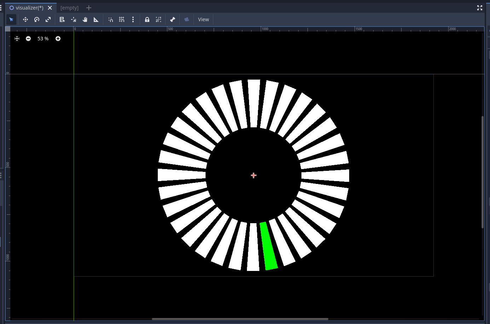
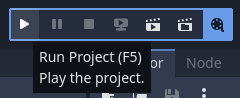

### Godot Audio Visualizer

A Godot 4 radial audio visualizer for music video creation. Based on <a href="https://godotengine.org/asset-library/asset/2762">Audio Spectrum Visualizer example</a>. Works with Godot 4.0 and higher.

## How to Use

Import the project into Godot 4.0 or higher. Open the `visualizer.tscn` scene. Add your .wav or .mp3 file into the AudioStreamPlayer node's stream property. You can set up the visualizer appearance in the inspector of the root `Visualier` node.

The green line in the editor represents the lowest frequency indicator. Other frequencies will be mapped in a clockwise order starting from the green line.

When you're ready to capture the video, enabled Godot's movie maker mode and run the project. You can choose to export the video as an .avi file or a series of .png files.

